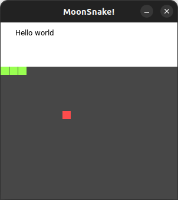

# Moonsnake!
A game of snake implemented using [Moonscript](moonscript.org/) and the [Love2d](https://love2d.org/) framework

## Current Status

* Basic board and cell rendering implemented
* A theme system created
* Fleshed out classes a bit more to improve ergonomics.

Current screenshot of game:

### TODO:
- [ ] Create snake class
  - Partially complete, need to build in rest of functionality
- [ ] Create food class
- [ ] Update `score_board` implementation
  * Probably extend `Board` and include `update_score` and `update_difficulty` methods
  * Likely `draw` method that uses super of `Board\draw()` plus rendering difficulty and score values.
- [ ] Figure out how to make fonts look nice in Love2D

## Resources

* [Leafo](https://github.com/leafo) and especially their [Love2d games written in moonscript](https://github.com/leafo/ludum-dare-30/tree/master)
* [Programming in Lua](https://www.lua.org/pil/contents.html)
* [Moonscript language reference](https://moonscript.org/reference)